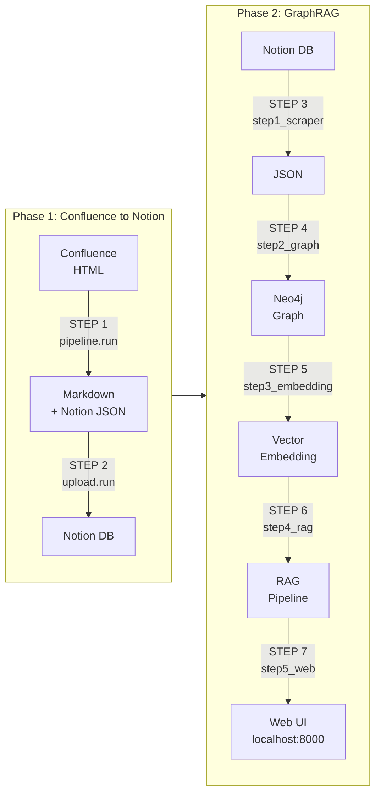

# ConfluencetoNotion

Confluence 문서를 Notion으로 마이그레이션하고, Neo4j 기반 GraphRAG 지식 검색 시스템을 구축한다.

---

## 아키텍처



---

## Quick Start

### 1. 프로젝트 클론 및 설치

```powershell
git clone https://github.com/choiminjong/ConfluencetoNotion.git
cd ConfluencetoNotion
.\init.ps1
```

`init.ps1`이 다음을 자동으로 처리한다:
- uv 패키지 매니저 설치 (없는 경우)
- `.python-version` 기준 Python 자동 다운로드
- `.venv/` 가상환경 생성 + 패키지 설치
- `.env.example` → `.env` 복사

### 2. 환경변수 설정

`.env` 파일을 열어 필수 값을 채운다:

```env
# Phase 1
CONFLUENCE_URL=https://your-confluence.example.com
CONFLUENCE_PAT=your-token
CONFLUENCE_PAGE_IDS=1234567890

NOTION_TOKEN=ntn_xxxxx
NOTION_DATABASE_ID=xxxxx-xxxxx-xxxxx

# Phase 2
NEO4J_PASSWORD=your-password
AWS_ACCESS_KEY_ID=xxxxx
AZURE_OPENAI_API_KEY=xxxxx
```

### 3. 실행

```bash
# Phase 1: Confluence → Notion 마이그레이션
python -m pipeline.run          # STEP 1: Confluence → Markdown → Notion JSON
python -m upload.run            # STEP 2: Notion DB 업로드

# Phase 2: GraphRAG 파이프라인
python -m graphrag.step1_scraper.run    # STEP 3: Notion → JSON
python -m graphrag.step2_graph.run      # STEP 4: JSON → Neo4j 그래프
python -m graphrag.step3_embedding.run  # STEP 5: 임베딩 생성
python -m graphrag.step4_rag.run        # STEP 6: RAG 파이프라인 검증
python -m graphrag.step5_web.run        # STEP 7: 웹 UI (http://localhost:8000)
```

---

## 프로젝트 구조

| 폴더 | 역할 |
|------|------|
| `pipeline/` | STEP 1: Confluence → Markdown → Notion JSON 변환 |
| `upload/` | STEP 2: Notion DB 업로드 |
| `graphrag/step1_scraper/` | STEP 3: Notion API로 데이터 추출 → JSON |
| `graphrag/step2_graph/` | STEP 4: JSON → Neo4j 지식 그래프 구축 |
| `graphrag/step3_embedding/` | STEP 5: Azure OpenAI 임베딩 생성 |
| `graphrag/step4_rag/` | STEP 6: GraphRAG 파이프라인 구성 + 검증 |
| `graphrag/step5_web/` | STEP 7: FastAPI 웹 시각화 서버 |
| `package/` | 로컬 패키지 (confluence-markdown-exporter, notion-markdown) |
| `doc/` | 문서 |

---

## 문서

- **[시작 가이드](doc/getting-started.md)** -- 설치, 환경변수, 실행 상세 안내
- **[릴리즈 노트](doc/release/CHANGELOG.md)** -- 버전별 변경 이력
- **[변환 스펙](doc/spec/migration-spec.md)** -- Phase 1/2 변환 규격, GraphRAG 스키마
- **[의존성](doc/dependencies.md)** -- 패키지 및 라이선스

---

## 사전 요구사항

- **Windows** (PowerShell)
- **Neo4j Desktop** -- [다운로드](https://neo4j.com/download/) (Phase 2 사용 시)
- **VS Code** (권장) -- Python 확장 설치 후 인터프리터를 `.venv\Scripts\python.exe`로 선택

> Python과 uv는 `init.ps1` 실행 시 자동으로 설치된다.
