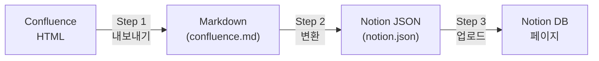

# Confluence to Notion 변환 호환성 가이드

> 이 문서는 Confluence 페이지를 Notion으로 마이그레이션할 때  
> **어떤 요소가 변환되고, 어떻게 변환되며, 어떤 제한이 있는지** 안내합니다.  
> Confluence 매크로가 100종 이상이지만, 이 도구가 처리하는 범위를 정확히 파악하여  
> "내 페이지가 어디까지 되고 어디까지 안 되는지" 판단할 수 있습니다.

---

## 1. 변환 파이프라인 개요

마이그레이션은 3단계로 진행됩니다.



| 단계 | 설명 | 입력 | 출력 |
|------|------|------|------|
| Step 1 | Confluence HTML을 Markdown으로 변환 | Confluence 페이지 (API) | `confluence.md`, `meta.json`, 첨부파일 |
| Step 2 | Markdown을 Notion API 블록 JSON으로 변환 | `confluence.md` | `notion.json` |
| Step 3 | Notion DB에 페이지 생성 및 블록 업로드 | `notion.json`, 이미지/비디오 | Notion 페이지 |

각 단계에 걸쳐 **자동 보정 로직 33개** (전처리 21 + 후처리 8 + 업로드 4)가 동작하여 Confluence 고유 패턴과 Notion API 제약을 처리합니다.

---

## 2. 전체 호환성 요약

모든 Confluence 요소의 변환 지원 상태를 한눈에 확인할 수 있습니다.

- **완전**: 원본과 동일하거나 거의 동일하게 변환됩니다.
- **부분**: 변환은 되지만 일부 서식이나 구조가 달라집니다.
- **미지원**: 변환되지 않으며, 해당 내용이 누락됩니다.

### 텍스트 서식

| Confluence 요소 | 지원 | Notion 변환 결과 | 참고 |
|---|---|---|---|
| **볼드** | 완전 | 볼드 텍스트 | |
| *이탤릭* | 완전 | 이탤릭 텍스트 | |
| ~~취소선~~ | 완전 | 취소선 텍스트 | |
| 밑줄 | 미지원 | 일반 텍스트 | Markdown이 밑줄을 지원하지 않습니다 |
| 위첨자 / 아래첨자 | 부분 | HTML 태그로 유지 | `<sup>`, `<sub>` 그대로 표시 |
| 인라인 코드 | 완전 | 코드 서식 텍스트 | |

### 구조 요소

| Confluence 요소 | 지원 | Notion 변환 결과 | 참고 |
|---|---|---|---|
| 제목 (H1~H3) | 완전 | 동일한 제목 블록 | |
| 제목 (H4~H6) | 부분 | H3으로 통합 | 원본 깊이 정보 손실 |
| 글머리 기호 목록 | 완전 | 글머리 기호 목록 | |
| 번호 목록 | 완전 | 번호 목록 | |
| 작업 목록 (체크박스) | 완전 | 체크리스트 | 완료/미완료 상태 유지 |
| 테이블 | 완전 | 테이블 | 헤더 행 자동 감지, rowspan/colspan 병합 셀 내용 반복 복제 |
| 중첩 테이블 (테이블 안 테이블) | 자동 보정 | 외부 테이블 셀에 인라인 포함 | 내부 테이블을 `열1 \| 열2<br>열3 \| 열4` 형식으로 셀 안에 삽입합니다 |
| 인용문 (blockquote) | 완전 | 인용 블록 | |
| 중첩 인용문 (인용 안 인용) | 부분 | 단일 인용으로 평탄화 | Notion이 중첩 인용을 지원하지 않습니다 |
| 구분선 | 완전 | 구분선 | |
| 2단/3단 컬럼 레이아웃 | 부분 | 세로 순차 배치 + 구분선 | 좌우 비교 레이아웃이 상하 나열로 바뀝니다 |

### 콘텐츠 블록

| Confluence 요소 | 지원 | Notion 변환 결과 | 참고 |
|---|---|---|---|
| 코드 블록 | 완전 | 코드 블록 (언어 지정) | 언어 자동 감지 |
| 정보 알림 (info) | 완전 | 콜아웃 (ℹ️ 아이콘) | |
| 참고 알림 (note) | 완전 | 콜아웃 (📝 아이콘) | |
| 팁 알림 (tip) | 완전 | 콜아웃 (💡 아이콘) | |
| 경고 알림 (warning) | 완전 | 콜아웃 (⚠️ 아이콘) | |
| 패널 (panel) | 완전 | 콜아웃 (❗ 아이콘) | |
| 주의 알림 (caution) | 완전 | 콜아웃 (🚨 아이콘) | GitHub Alert `[!CAUTION]` 형식 |
| 중요 알림 (important) | 완전 | 콜아웃 (❗ 아이콘) | GitHub Alert `[!IMPORTANT]` 형식 |
| 접기/펼치기 (expand) | 완전 | 토글 블록 | 중첩 토글도 지원합니다 |
| 목차 (TOC) | 부분 | 목차 블록 | 페이지당 1개만 변환 |

### 미디어

| Confluence 요소 | 지원 | Notion 변환 결과 | 참고 |
|---|---|---|---|
| 본문 내 이미지 | 완전 | 이미지 블록 | 첨부파일 자동 다운로드 후 Notion에 업로드 |
| 본문 내 비디오 | 완전 | 비디오 블록 | mp4, webm, mov, avi, wmv, mkv 지원 |
| 외부 URL 이미지 | 완전 | 이미지 블록 (외부 URL) | URL 그대로 유지 |
| 테이블 셀 내 이미지 | 부분 | 테이블 아래 별도 배치 | `📎 파일명`으로 참조하고 하단에 이미지 표시 |
| 첨부파일 목록 | 완전 | (제거됨) | 본문에 불필요한 첨부 목록은 자동 삭제 |
| draw.io 다이어그램 | 부분 | 이미지 또는 Mermaid 코드 | 편집 불가, 미리보기 이미지로 대체 |
| PlantUML | 부분 | 코드 블록 | UML 정의 텍스트만 표시, 렌더링 불가 |

### 링크

| Confluence 요소 | 지원 | Notion 변환 결과 | 참고 |
|---|---|---|---|
| 외부 링크 | 완전 | 링크 | |
| Confluence 내부 페이지 링크 | 부분 | 텍스트만 유지 | Notion에서 링크가 유효하지 않으므로 제목 텍스트만 남깁니다 |
| 첨부파일 링크 | 완전 | 로컬 파일 경로 | 자동 다운로드 후 업로드 |
| 이메일 링크 | 완전 | mailto 링크 | 깨진 이메일 형식 자동 수정 |
| Jira 이슈 링크 | 완전 | 테이블 또는 인라인 링크 | 이슈 키, 요약, 상태 포함 |
| 앵커 링크 | 완전 | 앵커 링크 | |

### 매크로

| Confluence 매크로 | 지원 | Notion 변환 결과 | 참고 |
|---|---|---|---|
| panel / info / note / tip / warning | 완전 | 콜아웃 | 아이콘 자동 매핑 |
| expand (ui-expand) | 완전 | 토글 | 제목 포함, 중첩 지원 |
| tabs-group / tab-pane | 완전 | 탭별 토글 | 각 탭이 개별 토글로 변환 |
| ui-tabs (AuiTabs) | 완전 | 탭별 토글 | 하위 페이지 자동 연결 |
| horizontal-nav | 완전 | 탭별 토글 | 각 네비 항목이 개별 토글로 변환 |
| columnLayout | 부분 | 세로 순차 배치 | 다단 구조 손실, 구분선으로 영역 구분 |
| details (Page Properties) | 완전 | 인라인 테이블 | 비ASCII 키(한글 등) 지원 |
| drawio | 부분 | 이미지 / Mermaid 코드 | Mermaid 데이터 있으면 코드블록, 없으면 미리보기 이미지 |
| plantuml | 부분 | 코드 블록 | 렌더링 불가 |
| jira | 완전 | 테이블 / 인라인 링크 | 이슈/필터 자동 감지 |
| toc | 부분 | 목차 | 페이지당 1개만 변환 |
| attachments | 완전 | (제거됨) | 첨부 목록 섹션 자동 삭제 |
| scroll-ignore | 완전 | (숨김) | HTML 주석으로 변환, 내용 미표시 |
| **기타 모든 매크로** | **미지원** | **(건너뜀)** | `unsupported_macros.json`에 자동 기록 |

> **내가 쓰는 매크로가 위 목록에 없다면?**  
> 해당 매크로의 콘텐츠는 변환 결과에 포함되지 않습니다.  
> 실행 후 `unsupported_macros.json` 파일을 확인하면 어떤 매크로가 건너뛰어졌는지 매크로명, 페이지 ID, 발생 횟수와 함께 확인할 수 있습니다.  
> 새 매크로 지원이 필요하면 `converter_overrides.py`에 핸들러를 추가합니다.

### 메타데이터

| Confluence 요소 | 지원 | Notion 변환 결과 | 참고 |
|---|---|---|---|
| 페이지 제목 | 완전 | Name (title) 필드 | |
| Space 정보 | 완전 | Space 필드 | |
| 마지막 수정일 | 완전 | Updated (date) 필드 | |
| 부모 페이지 | 완전 | Parent Title 필드 | Notion 서브페이지가 아닌 속성값으로 보존 |
| 원본 URL | 완전 | Source URL 필드 | Confluence 원본 페이지로 돌아갈 수 있습니다 |
| 라벨 (태그) | 완전 | Topics (multi_select) 필드 | 업로드 시 포함 여부 선택 가능 |
| 이모티콘 | 부분 | 유니코드 이모지 | 23개 키 매핑 (고유 이모지 17종), 미매핑은 ▪️로 대체 |

---

## 3. 알아야 할 주요 차이점

Confluence에서 Notion으로 옮기면 아래와 같은 차이가 발생합니다.

| Confluence에서 | Notion에서 | 이유 |
|---|---|---|
| 탭(tabs)으로 콘텐츠 전환 | 토글(접기/펼치기)로 표시 | Notion에 탭 기능이 없습니다 |
| 2단/3단 컬럼 레이아웃 | 세로로 나열 (구분선 포함) | Notion API가 다단 레이아웃을 지원하지 않습니다 |
| H4, H5, H6 제목 | 모두 H3으로 표시 | Notion은 제목을 3단계까지만 지원합니다 |
| Confluence 페이지 간 링크 | 링크 텍스트만 남음 | Notion에서 Confluence URL이 유효하지 않습니다 |
| 테이블 안의 이미지 | 테이블 아래에 별도 표시 | Markdown 테이블이 셀 내 이미지를 지원하지 않습니다 |
| draw.io 다이어그램 편집 | 이미지로만 표시 (편집 불가) | Notion에 draw.io 통합이 없습니다 |
| 토글 > 토글 > 테이블 | 테이블이 텍스트로 변환 | Notion API가 깊은 중첩의 테이블을 거부합니다 |
| 인용 안의 인용 | 단일 인용으로 합쳐짐 | Notion API가 중첩 인용을 거부합니다 |
| 페이지 부모-자식 계층 | `Parent Title` 속성으로 보존 | Notion 서브페이지가 아닌 DB 속성으로 관계를 표현합니다 |
| 빈 컨테이너 페이지 | 자동 건너뜀 | 내용이 10자 미만인 빈 페이지는 변환하지 않고, 자식을 조상에 연결합니다 |
| 접근 불가 페이지 | 자동 건너뜀 | 권한이 없는 페이지는 경고 로그를 출력하고 건너뜁니다 |
| 문서 상태 | 모두 `Draft`로 생성 | 검토 후 Notion에서 `Active`로 변경하세요 |

---

## 4. 매크로 상세

### 4.1 직접 처리 오버라이드 (7종)

이 도구가 Confluence 패키지를 오버라이드하여 직접 변환하는 요소입니다.

#### Table (테이블)

- **Confluence에서**: HTML `<table>` 요소로 다양한 형태의 테이블을 표현합니다.
- **Notion에서**: Markdown 파이프 테이블(`| col1 | col2 |`)로 변환됩니다.
- **세부 동작**:
  - 헤더 행(`<th>`)을 자동 감지합니다.
  - `rowspan`/`colspan` 병합 셀은 빈 셀 대신 원본 내용을 반복 복제합니다. (예: `rowspan=2`이면 두 행 모두 같은 텍스트 표시)
  - 셀 안의 이모티콘 SVG를 유니코드 이모지로 변환합니다.
  - 셀 안의 이미지는 `📎 파일명` 텍스트로 대체하고, 테이블 하단에 별도 이미지로 배치합니다.
  - 셀 안에 여러 블록 요소(p, div, heading 등)가 있으면 `<br>`로 결합합니다.
  - 중첩 테이블(테이블 안 테이블)은 내부 테이블을 `열1 | 열2<br>열3 | 열4` 형식으로 외부 셀 안에 인라인 삽입합니다.

#### ui-tabs / ui-tab

- **Confluence에서**: 탭 형태로 콘텐츠를 전환하여 봅니다.
- **Notion에서**: 각 탭이 개별 **토글 블록**으로 변환됩니다. 토글 제목이 탭 이름이 됩니다.
- **참고**: 하위 페이지 링크가 자동으로 연결됩니다.

#### tabs-group / tab-pane

- **Confluence에서**: 또 다른 형태의 탭 매크로입니다.
- **Notion에서**: ui-tabs와 동일하게 각 탭이 **토글 블록**으로 변환됩니다.
- **차이점**: 이 매크로는 탭 내부의 실제 콘텐츠가 토글 안에 포함됩니다.

#### horizontal-nav-group / horizontal-nav-item

- **Confluence에서**: 가로 네비게이션 바 형태의 콘텐츠 전환입니다.
- **Notion에서**: 각 네비게이션 항목이 **토글 블록**으로 변환됩니다.

#### ui-expand

- **Confluence에서**: 클릭하면 펼쳐지는 접기/펼치기 영역입니다.
- **Notion에서**: **토글 블록**으로 변환됩니다. 제목과 내용이 그대로 유지됩니다.
- **참고**: 중첩된 expand (접기 안의 접기)도 정상 처리됩니다.

#### details (Page Properties)

- **Confluence에서**: 페이지 속성을 키-값 테이블로 표시합니다.
- **Notion에서**: 동일한 형태의 **인라인 테이블**로 변환됩니다.
- **참고**: 한글 등 비ASCII 키도 정상 지원합니다.

#### columnLayout

- **Confluence에서**: 2단, 3단 등 다단 컬럼으로 콘텐츠를 배치합니다.
- **Notion에서**: 각 컬럼이 **세로로 순차 배치**되며, 컬럼 사이에 `---` 구분선이 삽입됩니다.
- **주의**: 좌우 비교 레이아웃의 시각적 효과가 손실됩니다.

### 4.2 패키지 기본 매크로 (12종)

`confluence-markdown-exporter` 패키지가 기본적으로 처리하는 매크로입니다.

| 매크로 | 변환 결과 | 설명 |
|---|---|---|
| panel | 콜아웃 (❗) | 강조 패널 |
| info | 콜아웃 (ℹ️) | 정보 알림 |
| note | 콜아웃 (📝) | 참고 알림 |
| tip | 콜아웃 (💡) | 팁 알림 |
| warning | 콜아웃 (⚠️) | 경고 알림 |
| drawio | 이미지 / Mermaid 코드 | Mermaid 데이터가 있으면 코드블록, 없으면 미리보기 이미지 |
| plantuml | 코드 블록 | `editor2` XML에서 UML 정의 추출 |
| scroll-ignore | (숨김) | HTML 주석으로 변환, 내용 미표시 |
| toc | 목차 | 페이지당 1개만 변환 |
| jira | 테이블 / 인라인 링크 | Jira 이슈 또는 필터 자동 감지 |
| attachments | (제거됨) | 첨부파일 목록 섹션 삭제 |
| details | 인라인 테이블 | Page Properties (커스텀 오버라이드로 처리) |

### 4.3 미지원 매크로

위 목록에 없는 모든 매크로는 **미지원**입니다. 미지원 매크로가 발견되면:

1. 해당 매크로의 콘텐츠는 **건너뜁니다** (변환 결과에 포함되지 않음).
2. 터미널에 경고가 출력됩니다: `WARN: 미지원 매크로 'macro-name' (page: 12345)`
3. `unsupported_macros.json` 파일에 자동으로 기록됩니다.

```json
[
  { "page_id": "12345", "macro_name": "fancy-plugin" },
  { "page_id": "12345", "macro_name": "custom-chart" }
]
```

**새 매크로 지원을 추가하려면**: `converter_overrides.py` 파일의 `_DIV_MACRO_OVERRIDES` 딕셔너리에 매크로 이름과 변환 함수를 추가합니다.

---

## 5. 자동 보정 상세 (33개)

이 도구는 Confluence 고유 패턴과 Notion API 제약을 처리하기 위해 **33개의 자동 보정 로직**을 실행합니다. 사용자가 직접 수정할 필요 없이 자동으로 처리됩니다.

### 5.1 Markdown 전처리 (21개)

Confluence에서 내보낸 Markdown을 Notion이 이해할 수 있도록 보정합니다.

#### 헤딩 보정 (4개)

| 보정 | 처리 전 | 처리 후 | 왜 필요한가 |
|---|---|---|---|
| H4~H6 통합 | `#### 제목` | `### 제목` | Notion은 H1~H3만 지원합니다. H4 이하 제목이 있으면 API가 거부합니다. |
| 인라인 헤딩 분리 | `텍스트## 제목` | `텍스트`<br>`## 제목` | Confluence 내보내기에서 줄바꿈이 누락되면 헤딩이 인식되지 않습니다. |
| 빈 헤딩 제거 | `## ` (내용 없음) | (삭제) | 텍스트 없는 빈 헤딩이 불필요한 빈 블록을 생성합니다. |
| 볼드 헤딩 정리 | `# **제목**` | `# 제목` | Confluence가 헤딩을 볼드로 감싸서 내보내면 중복 서식이 됩니다. |

#### 이미지 보정 (3개)

| 보정 | 처리 전 | 처리 후 | 왜 필요한가 |
|---|---|---|---|
| 볼드 이미지 해제 | `****` | `` | Confluence가 `<b></b>`로 내보내면 이미지가 텍스트로 깨집니다. |
| 헤딩 이미지 추출 | `# ` | `` | 헤딩 안에 이미지만 있으면 Notion API가 거부합니다. |
| 비디오 링크 변환 | `[video.mp4](path)` | `` | 비디오 파일이 일반 링크로 처리되면 재생이 안 됩니다. |

#### 링크 보정 (4개)

| 보정 | 처리 전 | 처리 후 | 왜 필요한가 |
|---|---|---|---|
| URL 3중 중복 제거 | `<url>url (url)` | `[url](url)` | Confluence가 같은 URL을 3번 반복 출력하는 버그가 있습니다. |
| 이메일 링크 수정 | `user@[domain](http://...)` | `[user@domain](mailto:...)` | Confluence 내보내기에서 이메일 형식이 깨집니다. |
| Confluence 내부 링크 제거 | `[제목](/pages/viewpage...)` | `제목` (텍스트만) | Confluence URL이 Notion에서 유효하지 않으므로 텍스트만 남깁니다. |
| 리스트 내 헤딩 변환 | `- ### 항목` | `- **항목**` | 리스트 안의 헤딩은 Notion에서 블록이 분리되어 목록 구조가 깨집니다. |

#### 구조 변환 (7개)

| 보정 | 처리 전 | 처리 후 | 왜 필요한가 |
|---|---|---|---|
| Alert 변환 | `> [!NOTE]` 블록 | 콜아웃 (아이콘 포함) | GitHub Alert 형식을 Notion 콜아웃으로 변환합니다. 5종 지원: TIP(💡), WARNING(⚠️), NOTE(📝), CAUTION(🚨), IMPORTANT(❗) |
| Details 변환 | `<details>/<summary>` | 토글 마커 | HTML 태그를 Notion toggle로 변환하기 위한 중간 형태입니다. |
| blockquote 내 Details | `> <details>...` | `>` 제거 후 변환 | blockquote 안의 details 태그에 `>` 접두사가 붙어 토글 변환이 실패합니다. |
| 이중 인용 평탄화 | `> > 텍스트` | `> 텍스트` | Notion API가 중첩 인용(quote > quote)을 거부합니다. |
| HTML 테이블 변환 | `<table>...</table>` | Markdown 파이프 테이블 | Markdown 본문에 잔존하는 HTML 테이블을 정규 테이블로 변환합니다. |
| BR 매크로 변환 | `{{BR}}` | 줄바꿈 | Confluence의 강제 줄바꿈 매크로가 변환되지 않아 텍스트가 이어집니다. |
| 첨부파일 섹션 제거 | `## 첨부 파일` + 목록 | (삭제) | 본문에 자동 삽입되는 첨부파일 목록이 불필요합니다. |

#### 기타 보정 (3개)

| 보정 | 처리 전 | 처리 후 | 왜 필요한가 |
|---|---|---|---|
| pagetree 정리 | 복잡한 날짜+아이콘 링크 | `- 페이지 제목` | pagetree/children 매크로 출력이 복잡한 형태로 내보내집니다. |
| Velocity 이미지 제거 | `` | (삭제) | Confluence 템플릿 엔진의 이미지 참조가 무효합니다. |
| 인접 볼드 병합 | `**A****B**` | `**AB**` | Confluence가 `<b>A</b><b>B</b>`를 내보내면 볼드가 깨집니다. |

### 5.2 Notion JSON 후처리 (8개)

Markdown → JSON 변환 후 Notion API에 맞게 블록을 보정합니다.

| 보정 | 왜 필요한가 |
|---|---|
| 토글 마커 조립 | 전처리에서 생성한 `TOGGLE_START`/`TOGGLE_END` 마커를 실제 Notion toggle 블록으로 조립합니다. 중첩 토글도 처리합니다. |
| 잔여 HTML 태그 제거 | 변환 과정에서 남은 `</details>`, `<details>` 등의 태그가 빈 paragraph로 표시되는 것을 방지합니다. |
| 중첩 테이블 인라인 삽입 | Markdown과 Notion 모두 테이블 셀 안의 테이블을 지원하지 않습니다. 내부 테이블의 각 행을 `열1 \| 열2` 형식으로 변환하고 `<br>`로 줄바꿈하여 외부 셀 안에 삽입합니다. Notion에서 셀 내부에 줄바꿈 형태로 표시됩니다. |
| 셀 병합 반복 복제 | Markdown과 Notion 테이블은 `rowspan`/`colspan`을 지원하지 않습니다. 병합 영역(colspan 확장 칸, rowspan 아래 행)에 원본 셀 내용을 반복 복제합니다. 빈 셀 대신 내용이 반복되어 어느 항목의 데이터인지 파악할 수 있습니다. |
| 중첩 테이블 평탄화 | 토글 > 토글 > 테이블 같은 깊은 중첩(depth 2 이상)의 테이블을 Notion API가 거부합니다. 테이블 내용을 텍스트(`열1 \| 열2`)로 변환하여 보존합니다. |
| 콜아웃 내부 파싱 | 콜아웃(알림) 안의 **볼드**, [링크](url), 가 plain text로만 표시됩니다. 이를 파싱하여 Notion 서식으로 변환합니다. |
| 토글 내부 리스트 | 토글 안의 `- 항목` 텍스트가 리스트가 아닌 일반 텍스트로 표시됩니다. 불릿 리스트 블록으로 분리합니다. |
| 인라인 이미지 추출 | 토글/콜아웃 안의 `` 텍스트가 이미지가 아닌 텍스트로 표시됩니다. 별도 이미지 블록으로 분리합니다. |
| 이미지 → 비디오 변환 | URL 확장자가 비디오(.mp4, .webm, .mov, .avi, .wmv, .mkv)인 이미지 블록을 비디오 블록으로 교체합니다. 그래야 Notion에서 재생할 수 있습니다. |
| 중첩 quote 평탄화 | quote 안의 quote (children 포함) 구조를 Notion API가 거부합니다. 내부 quote를 paragraph로 변환하고 children을 형제 블록으로 승격시킵니다. |

### 5.3 업로드 보정 (4개)

Notion API에 블록을 전송하기 직전에 실행되는 보정입니다.

| 보정 | 왜 필요한가 |
|---|---|
| 잘못된 URL 링크 제거 | 앵커(`#section`), 상대경로(`../page`) 등 Notion API가 거부하는 URL 형식의 링크를 자동으로 제거합니다. 링크 텍스트는 유지되고 링크만 해제됩니다. |
| 유효하지 않은 미디어 필터링 | `file_upload`로 변환되지 않은 로컬 경로(non-HTTP) 이미지/비디오 블록을 사전에 제거합니다. 그대로 전송하면 Notion API가 `"Invalid image url"` 에러를 반환합니다. |
| 로컬 미디어 file_upload 변환 | 다운로드된 로컬 이미지/비디오 파일을 Notion File Upload API로 먼저 업로드한 뒤, 블록 내 URL을 `file_upload` 참조 ID로 교체합니다. caption(캡션)은 유지됩니다. |
| 테이블 셀 rich_text sanitize | 일반 블록뿐 아니라 테이블의 각 셀(`table_row.cells`) 내부에도 2,000자 분할과 잘못된 링크 제거를 적용합니다. 테이블 셀도 동일한 Notion API 제한을 받기 때문입니다. |

---

## 6. Notion API 제약사항 상세

Notion API에는 몇 가지 구조적 제한이 있습니다. 이 도구는 이를 자동으로 대응하지만, 원본과 달라지는 부분이 있으므로 알아두는 것이 좋습니다.

### 6.1 토글 > 토글 > 테이블

- **무엇이 안 되는지**: Confluence에서 접기 안의 접기 안에 테이블이 있는 구조입니다.
- **왜 안 되는지**: Notion API가 depth 2 이상에서 table 블록을 거부합니다.
- **어떻게 처리하는지**: 테이블 내용을 `열1 | 열2 | 열3` 형태의 텍스트로 변환합니다.
- **사용자가 알아야 할 점**: 테이블의 시각적 서식(행/열 구분선)은 손실되지만, 데이터 내용은 보존됩니다.

### 6.2 중첩 인용 (quote > quote)

- **무엇이 안 되는지**: 인용 블록 안에 또 다른 인용 블록이 있는 구조입니다.
- **왜 안 되는지**: Notion API가 children이 있는 quote 안의 quote를 거부합니다.
- **어떻게 처리하는지**: 내부 인용을 일반 paragraph로 변환하고, children을 형제 블록으로 승격시킵니다.
- **사용자가 알아야 할 점**: 인용의 시각적 구분(들여쓰기 단계)이 단일 인용으로 합쳐집니다.

### 6.3 H4~H6 제목

- **무엇이 안 되는지**: Confluence에서 H4, H5, H6 수준의 깊은 제목을 사용하는 경우입니다.
- **왜 안 되는지**: Notion API가 heading_1, heading_2, heading_3만 지원합니다.
- **어떻게 처리하는지**: H4~H6을 모두 H3(heading_3)으로 변환합니다.
- **사용자가 알아야 할 점**: 원본 제목의 깊이 정보가 손실됩니다. H4와 H5가 있었다면 둘 다 같은 수준으로 표시됩니다.

### 6.4 rich_text 2,000자 초과

- **무엇이 안 되는지**: 하나의 텍스트 블록에 2,000자(UTF-16 기준) 이상의 텍스트가 있는 경우입니다.
- **왜 안 되는지**: Notion API의 rich_text content 필드가 2,000자로 제한됩니다.
- **어떻게 처리하는지**: 줄바꿈 → 공백 → 강제 위치 순서로 최적의 분할 지점을 찾아 자동 분할합니다.
- **사용자가 알아야 할 점**: 내용은 보존되며, 분할 위치에서 시각적으로 구분이 생길 수 있습니다.

### 6.5 rich_text 배열 100개 초과

- **무엇이 안 되는지**: 하나의 블록에 서식(볼드, 링크 등)이 매우 많아 rich_text 배열이 100개를 초과하는 경우입니다.
- **왜 안 되는지**: Notion API의 rich_text 배열 최대 길이가 100입니다.
- **어떻게 처리하는지**: 100개를 초과하는 부분을 잘라냅니다.
- **사용자가 알아야 할 점**: 서식이 매우 많은 긴 텍스트의 말단 부분이 손실될 수 있습니다. 실제로는 매우 드문 경우입니다.

### 6.6 블록 100개/요청 제한

- **무엇이 안 되는지**: 한 페이지에 블록이 100개 이상인 경우입니다.
- **왜 안 되는지**: Notion API가 한 번의 요청에 최상위 블록 100개까지만 허용합니다.
- **어떻게 처리하는지**: 블록을 100개씩 나눠서 순서대로 전송합니다.
- **사용자가 알아야 할 점**: 영향 없습니다. 자동으로 처리되며 콘텐츠 순서도 유지됩니다.

### 6.7 다단 컬럼 레이아웃

- **무엇이 안 되는지**: Confluence의 2단, 3단 컬럼 레이아웃입니다.
- **왜 안 되는지**: Notion API가 다단 레이아웃을 지원하지 않습니다.
- **어떻게 처리하는지**: 각 컬럼의 콘텐츠를 세로로 순차 배치하고, 컬럼 사이에 구분선(`---`)을 삽입합니다.
- **사용자가 알아야 할 점**: 좌우 비교 형태의 레이아웃이 상하 나열로 변경됩니다.

### 6.8 잘못된 URL 형식

- **무엇이 안 되는지**: `#section-anchor`, `../relative/path`, `page.html` 같은 비절대 URL이 링크에 포함된 경우입니다.
- **왜 안 되는지**: Notion API가 `http://`, `https://`, `mailto:`, `/`로 시작하지 않는 URL을 거부합니다.
- **어떻게 처리하는지**: 해당 링크를 자동으로 제거하고, 링크 텍스트는 일반 텍스트로 유지합니다.
- **사용자가 알아야 할 점**: Confluence 내부 앵커나 상대 링크는 텍스트만 남습니다. 필요 시 Notion에서 수동으로 링크를 설정하세요.

### 6.9 잘못된 미디어 URL

- **무엇이 안 되는지**: 로컬 파일 경로(`image.png`, `video.mp4`)가 이미지/비디오 블록의 external URL로 남아 있는 경우입니다.
- **왜 안 되는지**: Notion API가 `http://`로 시작하지 않는 external URL을 `"Invalid image url"` 에러로 거부합니다.
- **어떻게 처리하는지**: 해당 이미지/비디오 블록을 제거하고 경고 로그를 출력합니다. 정상적인 경우 로컬 파일은 `file_upload`로 변환되므로, 이 필터에 걸리는 것은 다운로드 실패 등 예외적 상황입니다.
- **사용자가 알아야 할 점**: 터미널에 `WARN: 잘못된 {type} URL 제거: {url}` 메시지가 출력됩니다. 해당 첨부파일의 다운로드 상태를 확인하세요.

### 6.10 중첩 테이블

- **무엇이 안 되는지**: 테이블 셀 안에 또 다른 테이블이 있는 구조입니다.
- **왜 안 되는지**: Markdown과 Notion 모두 테이블 셀 안에 테이블을 넣는 것을 지원하지 않습니다.
- **어떻게 처리하는지**: 내부 테이블의 각 행을 `열1 | 열2` 형식으로 변환하고 `<br>`로 줄바꿈하여 외부 셀 안에 인라인 삽입합니다.

  예시:
  ```
  외부 셀 내용:
  Method | GET, POST
  Auth   | Bearer
  Rate   | 100/min
  ```
- **사용자가 알아야 할 점**: 내부 테이블이 완벽한 표 형태는 아니지만, `열 | 값` 형식으로 셀 안에서 줄바꿈되어 표시되므로 내용을 파악하고 수동 수정할 수 있습니다.

---

## 7. 이모티콘 매핑

Confluence 이모티콘(SVG 아이콘)을 유니코드 이모지로 자동 변환합니다. 현재 **23개 키** (고유 이모지 17종)가 매핑되어 있습니다.

| SVG 파일명 | 변환 결과 | 설명 |
|---|---|---|
| check.svg | ✅ | 체크 |
| error.svg | ❌ | 에러 |
| warning.svg | ⚠️ | 경고 |
| information.svg | ℹ️ | 정보 |
| smile.svg | 😀 | 미소 |
| sad.svg | 😢 | 슬픔 |
| cheeky.svg | 😛 | 장난 |
| laugh.svg | 😂 | 웃음 |
| wink.svg | 😉 | 윙크 |
| thumbs_up.svg | 👍 | 좋아요 |
| thumbs_down.svg | 👎 | 싫어요 |
| lightbulb_on.svg | 💡 | 전구 (켜짐) |
| lightbulb.svg | 💡 | 전구 |
| star_yellow.svg | ⭐ | 별 (노랑) |
| star_red.svg | ⭐ | 별 (빨강) |
| star_green.svg | ⭐ | 별 (초록) |
| star_blue.svg | ⭐ | 별 (파랑) |
| heart.svg | ❤️ | 하트 |
| broken_heart.svg | 💔 | 깨진 하트 |
| question.svg | ❓ | 물음표 |
| forbidden.svg | 🚫 | 금지 |
| add.svg | ➕ | 추가 |
| binoculars.svg | 🔍 | 쌍안경 |

### 이모티콘 추가 방법

매핑에 없는 이모티콘은 `▪️`로 대체되며 경고 로그가 출력됩니다:

```
WARN: 미지원 이모티콘 'blue-star.svg' → ▪️
```

새 이모티콘을 추가하려면 `converter_overrides.py`의 `CONFLUENCE_EMOTICON_MAP`에 항목을 추가합니다:

```python
CONFLUENCE_EMOTICON_MAP = {
    ...
    "blue-star.svg": "🔵",  # 추가
}
```

---

## 8. Notion DB 속성

페이지 생성 시 자동으로 설정되는 DB 속성입니다. DB에 속성이 없으면 자동 생성됩니다.

### 시스템 관리 속성

| 속성 | 타입 | 설명 | 예시 |
|---|---|---|---|
| Name | title | 페이지 제목 | `Teams 기본 사용법` |
| Space | rich_text | Confluence Space 이름 | `Confluence / Jira 가이드` |
| Updated | date | 마지막 수정일 | `2022-08-13` |
| Parent Title | rich_text | 부모 페이지 제목 | `IT 가이드` |
| Source URL | url | Confluence 원본 페이지 URL | `https://confluence.../viewpage.action?pageId=610667564` |
| Status | select | 문서 상태 | `Draft` (고정값) |
| Topics | multi_select | 라벨 태그 | `teams`, `M365` |

### 사용자 입력 속성

| 속성 | 타입 | 설명 | 예시 |
|---|---|---|---|
| Domain | select | 문서의 주제 영역 | `Jira`, `Confluence`, `CI/CD`, `Security` |

- **Status**: 모든 페이지가 `Draft`로 생성됩니다. 검토 완료 후 Notion에서 `Active`로 변경하세요.
- **Topics**: 업로드 시 Confluence 라벨 포함 여부를 선택할 수 있습니다 (y/n 프롬프트).
- **Domain**: 업로드 실행 시 대화형으로 입력합니다. Space Key 하나에 여러 도메인이 섞일 수 있으므로 사용자가 직접 지정합니다.

---

## 9. 출력 파일 구조

```
output/
└── {SpaceKey}_{PageID}_{날짜}/
    ├── index.json                 # 페이지 트리 구조 (부모-자식 관계)
    ├── convert_errors.json        # 변환 에러 (있는 경우)
    ├── upload_errors.json         # 업로드 에러 (있는 경우)
    ├── unsupported_macros.json    # 미지원 매크로 목록
    └── {PageID}/
        ├── confluence.md          # Step 1: 변환된 Markdown
        ├── notion.json            # Step 2: Notion API 블록 JSON
        ├── meta.json              # 페이지 메타데이터 (제목, Space, 수정일, 원본 URL)
        └── *.png / *.mp4          # 다운로드된 첨부파일
```

---

## 10. 자동 페이지 필터링

Step 1에서 모든 Confluence 페이지를 무조건 변환하지 않습니다. 아래 조건에 해당하면 자동으로 건너뜁니다.

### 10.1 빈 컨테이너 페이지 스킵

- **조건**: 변환된 Markdown이 10자 미만인 페이지
- **동작**: 해당 페이지를 건너뛰고 `SKIP: '페이지 제목' (빈 컨테이너 페이지)` 로그를 출력합니다.
- **자식 재배치**: 스킵된 페이지의 자식 페이지는 가장 가까운 유효 조상 페이지에 자동으로 연결됩니다. 계층 구조가 끊기지 않습니다.
- **사용 사례**: Confluence에서 하위 페이지를 정리하기 위한 빈 폴더 역할의 페이지가 이에 해당합니다.

### 10.2 접근 불가 페이지 스킵

- **조건**: Confluence API에서 `"Page not accessible"` 응답을 반환하는 페이지
- **동작**: 해당 페이지를 건너뛰고 `SKIP: {페이지ID} (접근 불가)` 로그를 출력합니다.
- **원인**: PAT(Personal Access Token)의 권한이 해당 Space나 페이지에 없는 경우입니다.

### 10.3 선택적 첨부파일 다운로드

- **기본 동작** (`download_all_attachments=False`): 본문에서 참조된 이미지와 비디오만 다운로드합니다. 불필요한 대용량 첨부파일을 건너뛰어 속도와 용량을 절약합니다.
- **전체 다운로드** (`download_all_attachments=True`): 페이지에 연결된 모든 첨부파일을 다운로드합니다.
- **설정 위치**: `run_convert.py`의 `ConfluenceExporter` 생성자 인자로 지정합니다.

---

## 11. 에러 리포트

마이그레이션 중 발생한 에러는 자동으로 기록됩니다. 에러가 발생해도 나머지 페이지는 계속 처리됩니다.

| 파일 | 단계 | 내용 |
|---|---|---|
| `convert_errors.json` | Step 1~2 | Markdown/JSON 변환 실패 페이지 목록 |
| `upload_errors.json` | Step 3 | Notion 업로드 실패 페이지 목록 |
| `unsupported_macros.json` | Step 1 | 변환하지 못한 Confluence 매크로 목록 (매크로명, 페이지 ID) |

### 업로드 실패 자동 복구

- 블록 업로드 실패 시, 생성된 빈 Notion 페이지를 자동 아카이브합니다.
- 실패 페이지는 `upload_errors.json`에 기록되며 성공으로 오보고되지 않습니다.

### 실패 페이지 재업로드

`upload_errors.json`을 기반으로 실패 페이지만 선별하여 재업로드할 수 있습니다.

```bash
python -m upload.run_retry                  # 대화형 폴더 선택
python -m upload.run_retry 폴더명           # 폴더 직접 지정
```

---

## 12. 마이그레이션 후 확인 체크리스트

업로드 완료 후 아래 항목을 확인하세요:

- [ ] **이미지**: 모든 이미지가 정상 표시되는지 확인
- [ ] **토글**: 접기/펼치기가 정상 동작하는지, 내용이 올바르게 들어있는지 확인
- [ ] **테이블**: 테이블 구조가 유지되는지, 데이터 누락이 없는지 확인
- [ ] **코드 블록**: 코드가 올바르게 표시되고 언어가 맞는지 확인
- [ ] **콜아웃**: 알림(info/note/tip/warning) 내용과 아이콘이 맞는지 확인
- [ ] **비디오**: 비디오가 재생되는지 확인
- [ ] **미지원 매크로**: `unsupported_macros.json`에서 누락된 콘텐츠가 있는지 확인
- [ ] **Status 변경**: 검토 완료된 페이지의 Status를 `Active`로 변경

---

## 13. 문제 발견 시 대응 (FAQ)

### "이미지가 안 보여요"

- **원인 1**: 첨부파일 다운로드 실패 -- 터미널 로그에서 다운로드 에러를 확인하세요.
- **원인 2**: Confluence 내부 UUID로 참조된 이미지 -- 파일명만 텍스트로 표시됩니다.
- **원인 3**: Notion File Upload API 실패 -- `upload_errors.json`을 확인하세요.

### "내용이 빠져있어요"

- **원인**: 미지원 매크로에 포함된 콘텐츠입니다.
- **확인**: `unsupported_macros.json`에서 어떤 매크로가 건너뛰어졌는지 확인하세요.
- **대응**: 해당 매크로를 `converter_overrides.py`에 추가하거나, Notion에서 수동으로 작성하세요.

### "표가 깨져있어요"

- **원인 1**: 중첩 테이블(테이블 안 테이블) -- 내부 테이블이 `열1 | 열2<br>열3 | 열4` 형식의 인라인 텍스트로 변환되어 셀 안에 표시됩니다. 완벽한 표 형태는 아니지만 내용은 보존됩니다.
- **원인 2**: 깊은 중첩의 테이블(토글 > 토글 > 테이블) -- Notion API 제한으로 테이블이 `열1 | 열2` 텍스트로 변환됩니다.
- **원인 3**: `rowspan`/`colspan` 병합 -- 병합 셀이 반복 복제되어 표시됩니다. 레이아웃이 달라질 수 있습니다.
- **대응**: 원본과 정확히 동일한 표가 필요하다면 Notion에서 수동으로 재작성하세요.

### "링크가 안 돼요"

- **원인**: Confluence 내부 페이지 링크입니다.
- **설명**: Confluence URL은 Notion에서 유효하지 않으므로 링크 텍스트만 남깁니다.
- **대응**: Notion 내에서 페이지 간 링크를 수동으로 설정하세요.

### "이모티콘이 ▪️로 표시돼요"

- **원인**: 매핑되지 않은 Confluence 이모티콘입니다.
- **확인**: 터미널 로그에서 `WARN: 미지원 이모티콘 'xxx.svg'` 메시지를 확인하세요.
- **대응**: `converter_overrides.py`의 `CONFLUENCE_EMOTICON_MAP`에 해당 이모티콘을 추가하세요.

### "어떤 페이지가 변환에서 빠졌어요"

- **원인 1**: 빈 컨테이너 페이지 (내용 10자 미만) -- 자동으로 건너뛰며, 자식 페이지는 조상에 재배치됩니다.
- **원인 2**: 접근 불가 페이지 -- PAT 권한이 해당 페이지에 없습니다.
- **확인**: 터미널 로그에서 `SKIP:` 메시지를 확인하세요.
- **대응**: 빈 페이지는 의도된 동작입니다. 접근 불가 페이지는 PAT 권한을 확인하세요.

### "업로드가 중간에 실패했어요"

- **원인**: 네트워크 오류, Rate Limit, 또는 Notion API 에러입니다.
- **확인**: `upload_errors.json`에서 실패 페이지 목록을 확인하세요.
- **대응**: `python -m upload.run_retry`로 실패 페이지만 재업로드할 수 있습니다.
