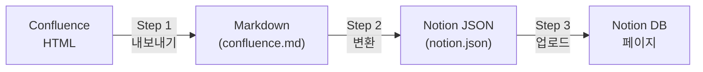

# Confluence to Notion 마이그레이션 변환 스펙

> 이 문서는 Confluence 페이지를 Notion DB로 마이그레이션할 때  
> **어떤 요소가 변환되고, 어떻게 변환되며, 어떤 제한이 있는지** 안내합니다.

---

## 1. 변환 파이프라인 개요

마이그레이션은 3단계로 진행됩니다.



| 단계 | 설명 | 입력 | 출력 |
|------|------|------|------|
| Step 1 | Confluence HTML을 Markdown으로 변환 | Confluence 페이지 (API) | `confluence.md`, `meta.json`, 첨부파일 |
| Step 2 | Markdown을 Notion API 블록 JSON으로 변환 | `confluence.md` | `notion.json` |
| Step 3 | Notion DB에 페이지 생성 및 블록 업로드 | `notion.json`, 이미지/비디오 | Notion 페이지 |

---

## 2. Step 1: Confluence to Markdown

Confluence 페이지의 HTML 본문을 Markdown 파일로 변환합니다.

### 2.1 지원 매크로

| Confluence 매크로 | 변환 결과 | 비고 |
|-------------------|-----------|------|
| panel, info, note, tip, warning | `> [!NOTE]` 등 GitHub Alert 형식 | callout 아이콘 자동 매핑 |
| expand (ui-expand) | `<details>/<summary>` (토글) | 제목 포함 |
| tabs-group / tab-pane | `<details>/<summary>` (토글) | 탭별 토글 생성 |
| ui-tabs (AuiTabs) | `<details>/<summary>` (토글) | 하위 페이지 자동 연결 |
| horizontal-nav | (제거됨) | 빈 문자열 반환, 콘텐츠 미표시 |
| drawio | 이미지 블록 | Mermaid 데이터 있으면 코드블록 |
| plantuml | `` ```plantuml ``` `` 코드블록 | `editor2` XML에서 추출 |
| jira | 테이블 또는 인라인 링크 | Jira 이슈/필터 |
| attachments | 파일 목록 테이블 | Step 2에서 제거됨 |
| toc | 목차 | 페이지당 1개 |
| details (Page Properties) | 인라인 테이블 | 비ASCII 키 지원 |
| scroll-ignore | HTML 주석 (숨김) | 내용 비표시 |
| columnLayout | 순차 블록 (`---` 구분) | 다단 → 단일 열 |

### 2.2 인라인 요소

| 요소 | 변환 결과 | 비고 |
|------|-----------|------|
| 페이지 링크 | `[제목](경로)` | Confluence 내부 링크 |
| 첨부파일 링크 | 로컬 파일 경로 | 자동 다운로드 |
| 이미지 | `` | 첨부파일 자동 다운로드 |
| 사용자 멘션 | 표시 이름 (텍스트) | `@사용자` 형태 유지 |
| 코드 블록 | `` ```언어 ``` `` | 언어 자동 감지 |
| 작업 목록 | `- [ ]` / `- [x]` | GitHub 스타일 체크리스트 |
| 이모티콘 | 유니코드 이모지 | ✅❌⚠️ 등 자동 매핑 |
| 테이블 | Markdown 파이프 테이블 | rowspan/colspan 지원 |

### 2.3 메타데이터

| 항목 | 설명 |
|------|------|
| `meta.json` | 페이지 ID, 제목, Space, 수정일, 원본 URL |
| `index.json` | 페이지 트리 구조 (부모-자식 관계) |
| YAML Frontmatter | 라벨 → `tags` (Notion Topics로 매핑) |

### 2.4 첨부파일 처리

| 유형 | 처리 방식 |
|------|-----------|
| 본문에 포함된 이미지 | 자동 다운로드 + 로컬 경로 치환 |
| 본문에 포함된 비디오 | 자동 다운로드 + 링크 보정 |
| 본문에 없는 첨부파일 | `download_all_attachments` 설정에 따라 선택 다운로드 |

---

## 3. Step 2: Markdown to Notion JSON

Markdown을 Notion API 호환 블록 JSON으로 변환합니다.  
**전처리**(Markdown 보정) → **변환**(notion-markdown) → **후처리**(블록 보정) 순서로 진행됩니다.

### 3.1 전처리 (Markdown 보정)

#### 헤딩 보정

| 변환 | 입력 예시 | 출력 예시 | 이유 |
|------|-----------|-----------|------|
| H4-H6 → H3 | `#### 제목` | `### 제목` | Notion은 H1-H3만 지원 |
| 인라인 헤딩 분리 | `텍스트## 제목` | `텍스트`<br>`## 제목` | 줄바꿈 누락 보정 |
| 빈 헤딩 제거 | `## ` (내용 없음) | (삭제) | 불필요한 빈 블록 방지 |
| 볼드 헤딩 정리 | `# **제목**` | `# 제목` | 중복 서식 제거 |

#### 이미지 보정

| 변환 | 입력 예시 | 출력 예시 |
|------|-----------|-----------|
| 볼드 이미지 해제 | `****` | `` |
| 헤딩 이미지 추출 | `# ` | `` |
| 비디오 링크 변환 | `[video.mp4](path)` | `` |

#### 링크 보정

| 변환 | 입력 예시 | 출력 예시 |
|------|-----------|-----------|
| URL 3중 중복 제거 | `<url>url (url)` | `[url](url)` |
| 이메일 링크 수정 | `user@[domain](http://...)` | `[user@domain](mailto:...)` |
| Confluence 내부 링크 제거 | `[제목](/pages/viewpage...)` | `제목` (텍스트만) |
| 리스트 내 헤딩 | `- ### 항목` | `- **항목**` |

#### 구조 변환

| 변환 | 입력 | 출력 |
|------|------|------|
| Alert → Callout | `> [!NOTE]` 블록 | `<aside>` 블록 (아이콘 포함) |
| Details → Toggle 마커 | `<details>/<summary>` | `TOGGLE_START::제목` / `TOGGLE_END` |
| HTML 테이블 → 파이프 테이블 | `<table>...</table>` | `\| 열1 \| 열2 \|` |
| `{{BR}}` → 줄바꿈 | `{{BR}}` | `\n` |
| 첨부파일 섹션 제거 | `## 첨부 파일` + 목록 | (삭제) |

### 3.2 Notion 블록 변환

`notion-markdown` 패키지가 전처리된 Markdown을 Notion API 블록 구조로 변환합니다.

### 3.3 후처리 (블록 보정)

| 변환 | 설명 |
|------|------|
| Toggle 마커 → toggle 블록 | `TOGGLE_START::제목` ~ `TOGGLE_END` 구간을 Notion toggle 블록으로 조립 (중첩 지원) |
| HTML 태그 제거 | 잔여 `</details>`, `<details>` 등 고아 태그 paragraph 삭제 |
| 중첩 테이블 평탄화 | depth 2 이상 테이블(`toggle > toggle > table`)을 텍스트 paragraph로 변환 |
| Callout 내부 파싱 | callout rich_text에서 **bold**, `[링크](url)`, `` 파싱 |
| Toggle 내부 리스트 | toggle 자식의 `- item` 텍스트를 `bulleted_list_item` 블록으로 분리 |
| 인라인 이미지 추출 | toggle/callout 자식 paragraph에서 `` 을 별도 image 블록으로 분리 |
| 이미지 → 비디오 | URL 확장자가 비디오(.mp4, .webm 등)인 image 블록을 video 블록으로 변환 |

---

## 4. Step 3: Notion DB 업로드

### 4.1 DB 속성

페이지 생성 시 자동으로 설정되는 Notion DB 속성:

| 속성 | 타입 | 설명 | 예시 |
|------|------|------|------|
| Name | title | 페이지 제목 | `Teams 기본 사용법` |
| Space | rich_text | Confluence Space 키 | `officeitcc` |
| Updated | date | 마지막 수정일 | `2022-08-13` |
| Parent Title | rich_text | 부모 페이지 제목 | `IT 가이드` |
| Source URL | url | 원본 Confluence URL | `https://confluence.../pages/viewpage.action?pageId=610667564` |
| Status | select | 문서 상태 | `Active` |
| Topics | multi_select | 라벨 태그 | `teams`, `M365` |
| Domain | select | 문서 영역 (업로드 시 지정) | `M365` |

DB에 속성이 없으면 자동 생성됩니다.

### 4.2 미디어 업로드

| 유형 | 처리 방식 |
|------|-----------|
| 로컬 이미지 | Notion File Upload API로 업로드 후 `file_upload` 참조로 교체 |
| 로컬 비디오 | 이미지와 동일한 방식 |
| 외부 URL 이미지 | `external` URL 그대로 유지 |
| 업로드 실패 미디어 | 경고 로그 출력, 해당 블록 제거 |

### 4.3 API 제한 대응

| 제한 | 대응 방법 |
|------|-----------|
| 블록 100개/요청 | 자동 분할 전송 |
| rich_text 2,000자 (UTF-16) | 자동 분할 (줄바꿈 > 공백 > 강제 위치에서 분할) |
| rich_text 배열 100개 | 초과 시 자르기 |
| Rate Limit (429) | 최대 5회 자동 재시도 (Retry-After 헤더 존중) |
| 잘못된 URL 링크 | `http://`, `https://`, `mailto:`, `/` 외 URL 자동 제거 |

---

## 5. 지원 Notion 블록 타입

마이그레이션 결과물에 포함되는 Notion 블록 타입:

| 카테고리 | 블록 타입 | 설명 |
|----------|-----------|------|
| 텍스트 | `paragraph` | 일반 텍스트 |
| | `heading_1` / `heading_2` / `heading_3` | 제목 (H1, H2, H3) |
| 리스트 | `bulleted_list_item` | 글머리 기호 목록 |
| | `numbered_list_item` | 번호 목록 |
| | `to_do` | 체크리스트 |
| 컨테이너 | `toggle` | 토글 (접기/펼치기) |
| | `callout` | 콜아웃 (아이콘 + 배경) |
| | `quote` | 인용 블록 |
| 코드 | `code` | 코드 블록 (언어 지정) |
| 미디어 | `image` | 이미지 (로컬 업로드 또는 외부 URL) |
| | `video` | 비디오 (로컬 업로드 또는 외부 URL) |
| 레이아웃 | `divider` | 구분선 |
| | `table` / `table_row` | 테이블 (헤더 + 본문 행) |
| 기타 | `equation` | 수식 |
| | `bookmark` | 북마크 링크 |
| | `embed` | 임베드 |

---

## 6. 알려진 제한사항

### 6.1 Notion API 제한

| 제한 | 영향 | 대응 |
|------|------|------|
| 헤딩 H1-H3만 지원 | H4-H6이 H3으로 변환됨 | 원본 헤딩 깊이 정보 일부 손실 |
| 테이블 중첩 depth 2 이상 불가 | `toggle > toggle > table` 구조의 테이블이 텍스트로 평탄화 | 내용은 보존, 테이블 서식 손실 |
| rich_text 2,000자 제한 | 긴 텍스트가 여러 세그먼트로 분할 | 내용 보존, 분할 위치에서 줄바꿈 |
| 다단 레이아웃 미지원 | 2단/3단 컬럼이 순차 배치로 변환 | `---` 구분선으로 영역 구분 |

### 6.2 Confluence 요소 제한

| 요소 | 상태 | 설명 |
|------|------|------|
| 미지원 매크로 | 자동 감지 | `unsupported_macros.json`에 기록, 내용은 건너뜀 |
| UUID 첨부파일 | 미다운로드 | Confluence 내부 ID로 참조된 인라인 이미지는 파일명만 표시 |
| 중첩 테이블 | HTML 유지 | Markdown에서 중첩 테이블 미지원 |
| Jira 테이블 | 1개/페이지 | 페이지당 하나의 Jira 테이블만 변환 |
| 목차 (TOC) | 1개/페이지 | 페이지당 하나의 목차만 변환 |
| 미인식 이모티콘 | `▪️` 대체 | 매핑되지 않은 Confluence 이모티콘 |

### 6.3 변환 품질 참고사항

| 항목 | 설명 |
|------|------|
| 이미지 위치 | 테이블 셀 내 이미지는 테이블 아래로 이동하여 `📎 파일명`으로 참조 |
| Confluence 내부 링크 | Notion에서 유효하지 않으므로 텍스트만 유지 |
| 페이지 트리 | 부모-자식 관계는 `Parent Title` 속성으로 보존 (Notion 서브페이지 아님) |
| 태그/라벨 | Confluence 라벨이 Notion `Topics` multi_select로 매핑 |

---

## 7. 출력 파일 구조

```
output/
└── {SpaceKey}_{PageID}_{날짜}/
    ├── index.json                 # 페이지 트리 구조
    ├── convert_errors.json        # 변환 에러 (있는 경우)
    ├── upload_errors.json         # 업로드 에러 (있는 경우)
    ├── unsupported_macros.json    # 미지원 매크로 목록
    └── {PageID}/
        ├── confluence.md          # 변환된 Markdown
        ├── notion.json            # Notion API 블록 JSON
        ├── meta.json              # 페이지 메타데이터
        └── *.png / *.mp4          # 다운로드된 첨부파일
```

---

## 8. 에러 리포트

마이그레이션 중 발생한 에러는 자동으로 기록됩니다.

| 파일 | 단계 | 내용 |
|------|------|------|
| `convert_errors.json` | Step 1-2 | Markdown/JSON 변환 실패 페이지 목록 |
| `upload_errors.json` | Step 3 | Notion 업로드 실패 페이지 목록 |
| `unsupported_macros.json` | Step 1 | 변환하지 못한 Confluence 매크로 목록 (매크로명, 페이지, 횟수) |

에러가 발생해도 나머지 페이지는 계속 처리됩니다.
